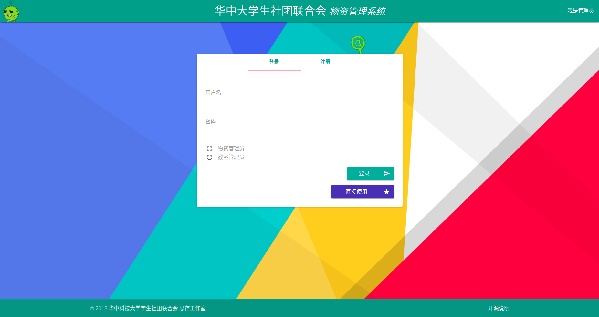
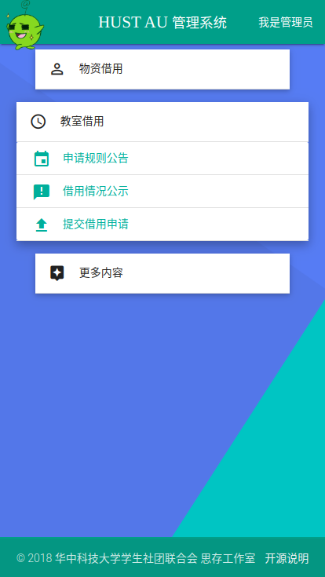
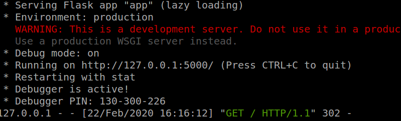

# 思存工作室- 社团网物资管理系统

HUST AUNET materials-management system

### 项目介绍
<div style="text-align:center;">

</div>

本项目是华中科技大学学生社团联合会思存工作室(@SicunStudio)完成的一个社团网物资管理系统。项目最终搭建了一个完成度较高的系统，具备一般人员登陆、填表、查询结果以及管理员操作等功能，并在 `email/branch` 分支中实现基础的邮件发送消息能力。

#### Technologies used:
- [Flask](https://palletsprojects.com/p/flask/) 利用Flask框架完成系统的前后端搭建
- [Materialize.css](http://materializecss.com/) 为网站的拟物化设计提供重要帮助
- [SQLite3](https://www.sqlite.org/index.html) 一个易上手的数据库引擎
- [Toastr](https://github.com/CodeSeven/toastr) 提供用户友好、拟物化的提示窗口      
- [Google material design icons](http://google.github.io/material-design-icons/) 提供了拟物化的图标
  
以及 ...
- [jQuery](https://jquery.com/), 一大JS利器

另外：项目也一定程度上注意到了响应式设计的要求，但并没有针对移动端做充足的调试，因此部分地方效果受影响。

<div style="text-align:center;">

</div>


### 如何使用/测试
1. `git clone` 当前repo地址到本地，确保本机安装了 python3 
2. 通过 python 的包管理器 `pip` 安装 `flask`
3. 系统的状态设定为本地调试，因此只需在根目录命令行中运行
```
python3 app.py
```
<div style="text-align:center;">

</div>

4. 如果一切顺利的话，按照提示在浏览器中转到 `http://127.0.0.1:5000/` 即可开始 hack 

另外提供了demo用途的管理员账号
for admin (物资):
- hash : au
- 村下没有树 ：666

for admin2 (教室):
- hash : au
- sudo ：pass

### 项目贡献者
项目的完成以17届成员为主力，但工作室学长学姐留下了一个基于Flask的 HR 系统为本系统提供了很多重要的参考，向他（她）们表示诚挚感谢和敬意。

Contributors include:
- @smdsbz
- @star-du
- @BamdaXP 
- @corthay